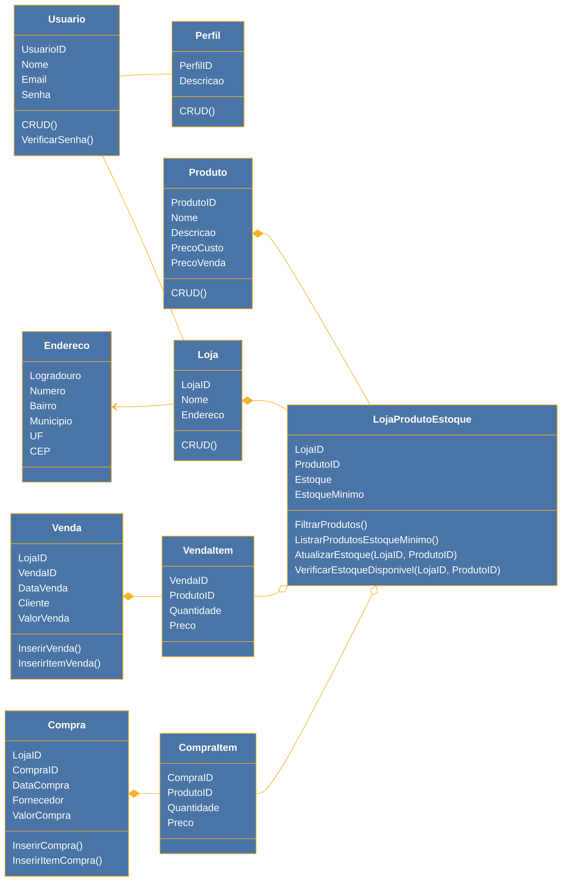

# Disciplina WEB 2
## Exercicio 01 - OOP

## Sistema de Controle de Estoque com Domínios de Usuário, Loja e Controle de Permissões

```mermaid
%%{
  init: {
    'theme': 'base',
    'themeVariables': {
      'primaryColor': '#4974a5',
      'primaryTextColor': '#fff',
      'primaryBorderColor': '#F8B229',
      'lineColor': '#F8B229',
      'secondaryColor': '#006100',
      'tertiaryColor': '#F8B229'
    }
  }
}%%
classDiagram
    direction LR
    class Usuario {
        UsuarioID
        Nome
        Email
        Senha
        CRUD()
        VerificarSenha()        
    }

    
    class Perfil {
        PerfilID
        Descricao
        CRUD()
    }
    class Endereco {
        Logradouro
        Numero
        Bairro
        Municipio
        UF
        CEP
    }

    class Loja{
        LojaID
        Nome
        Endereco
        CRUD()
    }

    class Produto {
        ProdutoID
        Nome
        Descricao
        PrecoCusto
        PrecoVenda
        CRUD()
    }

    class LojaProdutoEstoque{
        LojaID
        ProdutoID
        Estoque
        EstoqueMinimo
        FiltrarProdutos()
        ListrarProdutosEstoqueMinimo()
        AtualizarEstoque(LojaID, ProdutoID)
        VerificarEstoqueDisponivel(LojaID, ProdutoID)
    }

    class Venda {
        LojaID
        VendaID
        DataVenda
        Cliente
        ValorVenda
        InserirVenda()
        InserirItemVenda()
    }

    class VendaItem{
        VendaID
        ProdutoID
        Quantidade
        Preco
    }
    class Compra {
        LojaID
        CompraID
        DataCompra
        Fornecedor
        ValorCompra
        InserirCompra()
        InserirItemCompra()
    }

    class CompraItem{
        CompraID
        ProdutoID
        Quantidade
        Preco
    }

    Usuario -- Perfil 
    Usuario -- Loja
    Endereco <-- Loja
    Produto *-- LojaProdutoEstoque
    Loja *-- LojaProdutoEstoque
    Venda *-- VendaItem
    VendaItem --o LojaProdutoEstoque
    CompraItem --o LojaProdutoEstoque
    Compra *-- CompraItem

```